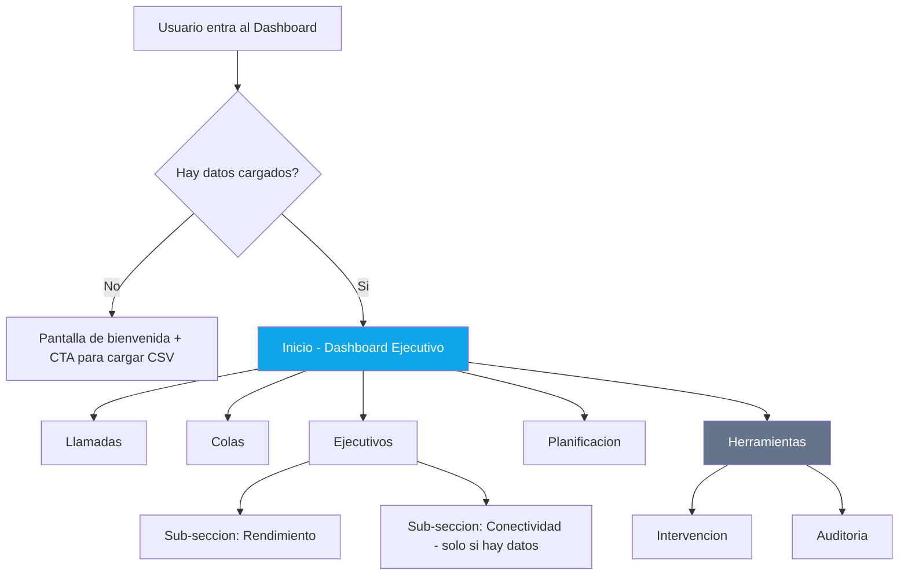

# Plan de Mejoras UX/UI -- Dashboard de Llamadas

## Objetivo Principal

Reorganizar la navegacion del dashboard para que sea mas clara, jerarquica y ordenada, reduciendo la carga cognitiva de 8 pestanas horizontales planas.

---

## Diagnostico de la situacion actual

### Estructura actual de tabs (sin jerarquia)

| Tab | Contenido | Problema |
|-----|-----------|----------|
| Vista Directiva | ExecutiveDashboard (8 KPI cards + trend + quick links) | Se solapa conceptualmente con "General" |
| General | KPICards + graficos de llamadas | Misma info que Vista Directiva pero desagregada |
| Colas | Analisis completo de colas | Bien delimitado |
| Ejecutivos | Analisis completo de ejecutivos | Bien delimitado |
| Planificacion | StaffingDemand + PhoneOccupancy | Bien delimitado pero solo 2 graficos |
| Conectividad | AgentConnectivityChart | Depende de datos externos; a veces vacio |
| Intervencion | InterventionImpact | Funcionalidad especifica |
| Auditoria | Audit logs | Funcionalidad de diagnostico, no de analisis |

### Problemas identificados

1. **8 pestanas horizontales sin jerarquia** -- el usuario no sabe por donde empezar ni como se relacionan
2. **"Vista Directiva" vs "General"** -- duplican informacion con distinto nivel de detalle, generando confusion
3. **Tabs que dependen de datos externos** (Conectividad) pueden aparecer vacios, generando frustracion
4. **Planificacion tiene poco contenido** (solo 2 graficos) y podria integrarse en otra seccion
5. **Auditoria e Intervencion** son herramientas de diagnostico, no vistas de analisis principales
6. **Sin breadcrumbs ni indicador de ubicacion** -- el usuario puede perderse facilmente
7. **Barra de filtros compleja** sin colapsar, ocupa espacio vertical valioso

---

## Propuesta: Nueva estructura de navegacion

### Layout general: Sidebar + Contenido

```
+----------------------------------------------------------+
| [Logo] Dashboard de Llamadas             [Cargar CSV]    |  Header simplificado
+------------+---------------------------------------------+
|            |                                             |
| SIDEBAR    |  Filtros (colapsables por defecto)          |
|            |  [Rango fecha] [Cola] [Ejecutivo] ...      |
| * Inicio   |                                             |
| * Llamadas |  +---------------------------------------+  |
| * Colas    |  |                                       |  |
| * Ejecut.  |  |     CONTENIDO DE LA SECCION          |  |
| * Planif.  |  |                                       |  |
| ---------  |  |                                       |  |
| Herramient.|  +---------------------------------------+  |
|  - Interv. |                                             |
|  - Auditor.|                                             |
+------------+---------------------------------------------+
```

### Secciones propuestas (reducidas de 8 a 5 principales + 2 herramientas)

#### Secciones principales (analisis)

| # | Seccion | Fusiona tabs actuales | Descripcion |
|---|---------|----------------------|-------------|
| 1 | **Inicio** | Vista Directiva | **Configuración optimizada para mostrar volumen, eficiencia y rankings de productividad.** Incluye: (1) Fichas de KPIs Directos con comparativa con periodo anterior (Llamadas Totales, a Cola, a Ejecutivo, Atendidas, Abandonadas, Tiempos promedio, AHT). (2) Panel de Gráficos Diarios con Funnel de Demanda Entrante (líneas de Llamadas Entrantes, Asignadas a Cola, Contestadas) y Volumen de Gestión Saliente con barras de Contactos Efectivos (verde #84BD00) e Intentos Fallidos. (3) Sección de Rankings con Ranking de Colas por Volumen Entrante y Top 10 Ejecutivos por Mayor Gestión Entrante. Colores institucionales: Azul BICE (#326295) para demanda, Verde BICE (#84BD00) para éxito/atención. Ver `docs/VISTA_DIRECTORIO_INICIO.md` para especificación técnica completa. |
| 2 | **Llamadas** | General | Vista detallada: KPIs, distribucion horaria, direccion, duraciones extremas, tablas resumidas |
| 3 | **Colas** | Colas | Todo el analisis de colas actual (se mantiene igual) |
| 4 | **Ejecutivos** | Ejecutivos + Conectividad | Analisis de ejecutivos + conectividad integrada como sub-seccion (solo visible si hay datos de agentes) |
| 5 | **Planificacion** | Planificacion | StaffingDemand + PhoneOccupancy |

#### Herramientas (grupo secundario, colapsable)

| # | Seccion | Fusiona tabs actuales | Descripcion |
|---|---------|----------------------|-------------|
| 6 | **Intervencion** | Intervencion | Se mantiene como herramienta separada |
| 7 | **Auditoria** | Auditoria | Se mantiene como herramienta separada |

---

## Cambios detallados por componente

### 1. `App.tsx` -- Header simplificado

**Cambios:**
- Eliminar boton de Auditoria del header (se accede desde sidebar)
- Eliminar boton de Estado Agentes del header (se integra en Ejecutivos)
- Dejar solo: Logo/Titulo + boton "Cargar CSV" (accion principal)
- Mover indicador de integridad de datos al sidebar (badge sutil)
- La barra de progreso de carga se mantiene

### 2. NUEVO: `Sidebar.tsx` -- Navegacion lateral

**Componente nuevo** que reemplaza la barra de tabs horizontal.

Estructura del sidebar:
```
+-------------------+
| NAVEGACION        |
|                   |
| [icono] Inicio    |
| [icono] Llamadas  |
| [icono] Colas     |
| [icono] Ejecutivos|  <-- badge si hay datos de agentes
| [icono] Planific. |
| ----------------- |
| HERRAMIENTAS  v   |  <-- colapsable
| [icono] Interven. |
| [icono] Auditoria |
|                   |
| [Indicador de     |
|  calidad de datos]|
+-------------------+
```

**Caracteristicas:**
- Sidebar fijo a la izquierda, ancho ~220px
- Colapsable en movil (hamburger menu)
- Seccion "Herramientas" colapsable por defecto
- Badge en Ejecutivos cuando hay datos de conectividad
- Indicador de calidad de datos sutil al fondo
- Item activo con highlight de color (bg-slate-800 text-white)
- Iconos de lucide-react

### 3. `Dashboard.tsx` -- Refactorizacion

**Cambios:**
- Eliminar la barra de tabs horizontal (se mueve al Sidebar)
- Recibir `activeSection` como prop desde App.tsx
- Eliminar estado interno `activeTab`
- Simplificar el renderizado condicional de secciones
- El dataset info bar se mantiene arriba del contenido

### 4. `FilterBar.tsx` -- Colapsable por defecto

**Cambios:**
- Por defecto mostrar solo: rango de fecha + contador de registros + boton "Filtros (N activos)"
- Al hacer clic en "Filtros", expandir los filtros adicionales con animacion
- Los chips de filtros activos siempre visibles (como ahora)
- Animacion de expandir/colapsar con max-height transition

### 5. `ExecutiveDashboard.tsx` -- Simplificado

**Cambios:**
- Eliminar los "quick links" de navegacion (ya no necesarios con sidebar siempre visible)
- Mantener 8 KPI cards + grafico de tendencia
- Agregar mini resumen de "Actividad reciente" para dar mas contexto
- El titulo de seccion es claro: "Panel de Control"

### 6. Seccion "Ejecutivos" -- Integrar Conectividad

**Cambios en Dashboard.tsx, seccion `ejecutivos`:**
- Si hay `agentStatusRecords`, mostrar sub-pestanas inline:
  - "Rendimiento" (charts actuales de ejecutivos)
  - "Conectividad" (AgentConnectivityChart)
- Si no hay datos, mostrar solo rendimiento sin la sub-tab
- Las sub-pestanas usan un estilo mas sutil que las del sidebar

### 7. Header de seccion unificado

**Componente nuevo (`SectionHeader.tsx`):** Cada seccion principal debe tener un header consistente:

```tsx
<SectionHeader 
  icon={PhoneCall}
  title="Analisis de Llamadas"
  description="Distribucion horaria, direccion y duracion de llamadas"
/>
```

Props:
- `icon`: Componente de lucide-react
- `title`: Titulo de la seccion
- `description?`: Descripcion opcional en texto secundario
- `actions?`: Botones de accion opcionales (exportar, etc.)

### 8. Mejoras visuales generales

- **Consistencia de KPI cards**: Unificar el estilo entre `KPICards.tsx` y `ExecutiveDashboard.tsx`
- **Estados vacios mejorados**: Icono mas grande, texto mas amigable, CTA clara
- **Transiciones**: Agregar transicion fade al cambiar de seccion (animate-fadeIn)
- **Scroll to top**: Al cambiar de seccion, hacer scroll al inicio del contenido

---

## Diagrama de flujo de navegacion



---

## Orden de implementacion

1. Crear el componente `Sidebar.tsx` con la nueva navegacion
2. Refactorizar `App.tsx` para usar Sidebar + layout de 2 columnas (grid o flex)
3. Refactorizar `Dashboard.tsx` para recibir `activeSection` como prop en lugar de manejar tabs internamente
4. Mejorar `FilterBar.tsx` con colapso por defecto
5. Integrar Conectividad como sub-seccion dentro de Ejecutivos
6. Crear componente `SectionHeader.tsx` para consistencia visual entre secciones
7. Unificar estilos de KPI cards entre KPICards y ExecutiveDashboard
8. Mejorar estados vacios y agregar transiciones suaves
9. Probar responsive (movil con sidebar colapsable via hamburger)

---

## Lo que NO se modifica

- Logica de KPI y procesamiento de datos (`src/lib/kpi.ts`)
- Componentes de graficos individuales (charts)
- Sistema de carga de CSV (`csvParser.ts`, `UploadModal.tsx`)
- Integracion con Supabase (`supabaseService.ts`)
- Panel de auditoria de datos (`DataAuditPanel.tsx`)
- Logica de filtros (solo se modifica la presentacion en FilterBar)
